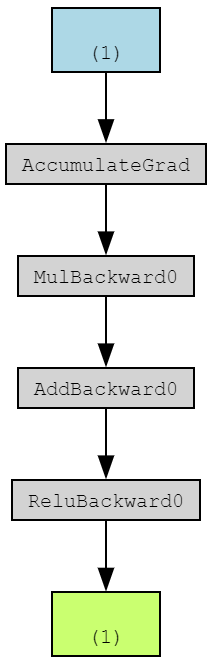

# microtorch

Microtorch is my own take to understand how backpropagation works in Pytorch. The Jupyter notebook first shows how a super simple Pytorch model can be built:

    x = torch.tensor([1.0], requires_grad=True)
    y = x * 2 + 1
    o = torch.relu(y)

[Torchviz](https://github.com/szagoruyko/pytorchviz) is a great way to show small neural network:

Then, the notebook implements a neural network model using only Pytorch's tensors for gradient descent. The model itself is not using Pytorch, it uses Karphaty's micrograd code: https://github.com/karpathy/micrograd. I recommend watching [The spelled-out intro to neural networks and backpropagation: building micrograd](https://www.youtube.com/watch?v=VMj-3S1tku0&t=7427s) to learn the basic of backpropagation.

